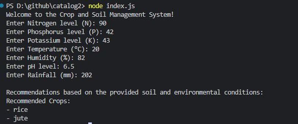

# Crop and Soil Management System

## Overview

The Crop and Soil Management System is a web application that helps farmers make informed decisions about crop selection based on soil and environmental conditions. The system provides recommendations for suitable crops based on user inputs for soil nutrients, temperature, humidity, pH, and rainfall.

## Features

- **Real-time Crop Recommendations**: Get recommendations for suitable crops based on your soil and environmental data.
- **Interactive Form**: Input your soil and environmental conditions to receive instant crop recommendations.
- **Responsive Design**: User-friendly interface that works on both desktop and mobile devices.

## Files

- **`index.html`**: The main HTML file that contains the user interface for inputting soil and environmental conditions.
- **`index.js`**: The JavaScript file that handles the logic for crop recommendations based on user input.

## Getting Started

### Running the Application

1. **Open the Web Application**

   Simply open the `index.html` file in your preferred web browser to start using the Crop and Soil Management System.

2. **Console-based Application**

   For running the console-based application:
   1. Ensure you have Node.js installed on your machine.
   2. Open a terminal or command prompt.
   3. Navigate to the directory containing `index.js`.
   4. Run the script with Node.js:
      ```bash
      node index.js
      ```

### Example Usage

1. **Web Application**

   - Enter the soil and environmental conditions in the input fields on the webpage.
   - View the crop recommendations displayed on the page.

2. **Console Application**

   - Follow the prompts in the terminal to enter soil and environmental conditions.
   - View the crop recommendations output directly in the terminal.

## Contributing

1. Fork the repository.
2. Create a feature branch (`git checkout -b feature/YourFeature`).
3. Commit your changes (`git commit -am 'Add new feature'`).
4. Push to the branch (`git push origin feature/YourFeature`).
5. Create a new Pull Request.



