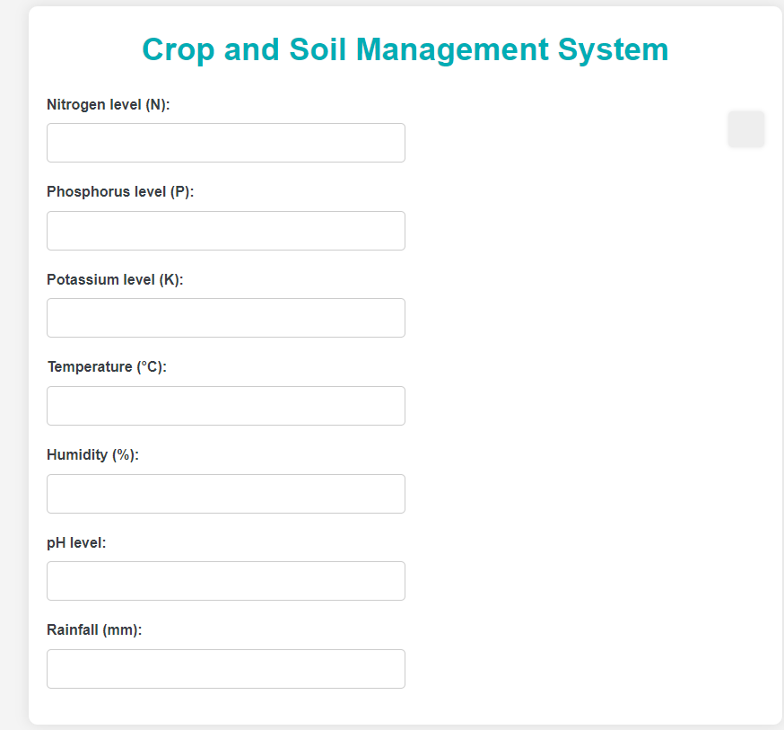
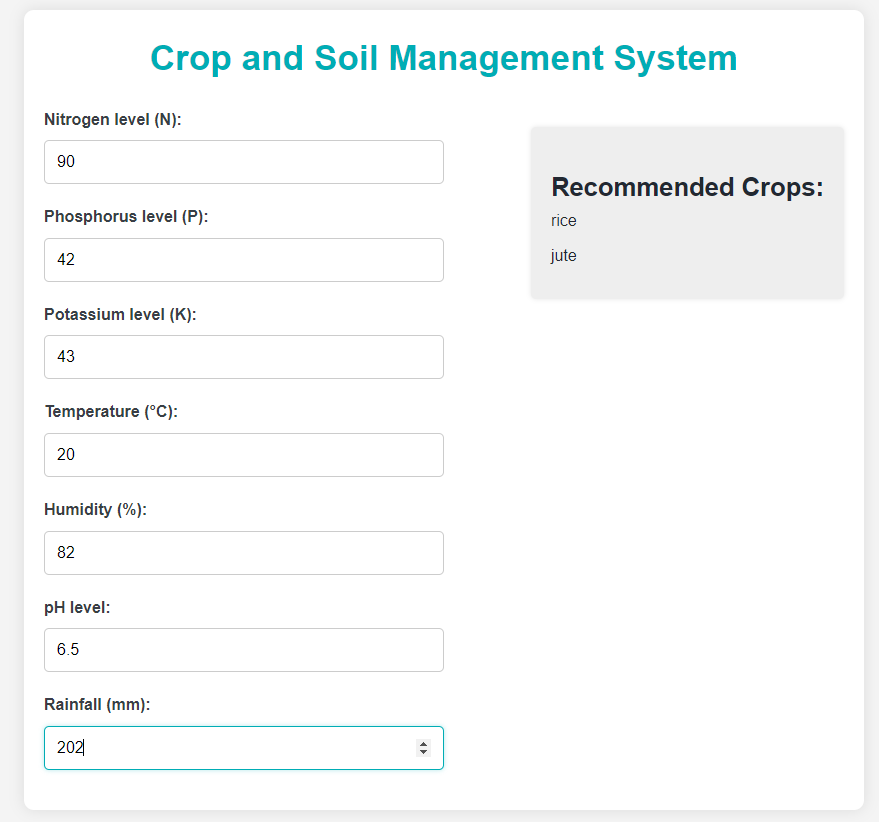
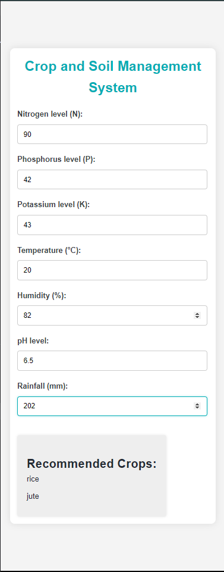

# Crop and Soil Management System

## Overview

The Crop and Soil Management System is an application designed to help farmers make informed decisions about crop selection based on soil and environmental conditions. The system provides recommendations for suitable crops based on user inputs for soil nutrients, temperature, humidity, pH, and rainfall.

## Features

- **Real-time Crop Recommendations**: Get recommendations for suitable crops based on your soil and environmental data.
- **Interactive Form**: Input your soil and environmental conditions to receive instant crop recommendations.
- **Responsive Design**: User-friendly interface that works on both desktop and mobile devices.

## Getting Started

### Prerequisites

- Node.js and npm installed on your machine.

### Installation

1. Clone the repository:
    ```bash
    git clone https://github.com/yourusername/crop-soil-management.git
    cd crop-soil-management
    ```

2. Install dependencies:
    ```bash
    npm install
    ```

3. Start the application:
    ```bash
    npm start
    ```

4. Open your browser and go to `http://localhost:3000`.

## Usage

1. Enter the soil and environmental conditions in the form fields.
2. View the recommended crops that are suitable for the provided conditions.

## Contributing

1. Fork the repository.
2. Create a feature branch (`git checkout -b feature/YourFeature`).
3. Commit your changes (`git commit -am 'Add new feature'`).
4. Push to the branch (`git push origin feature/YourFeature`).
5. Create a new Pull Request.





